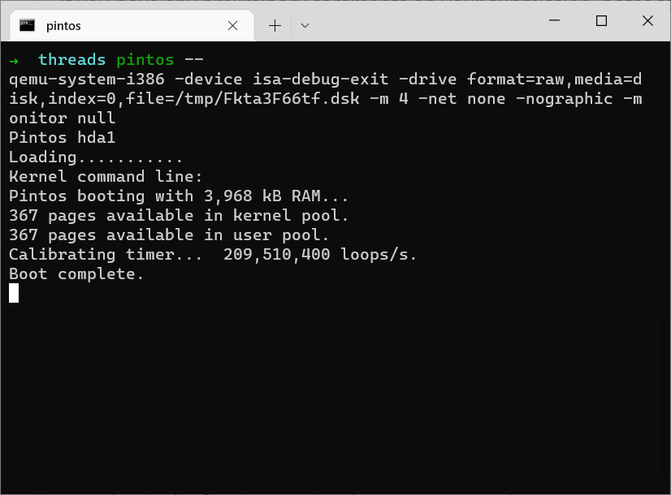
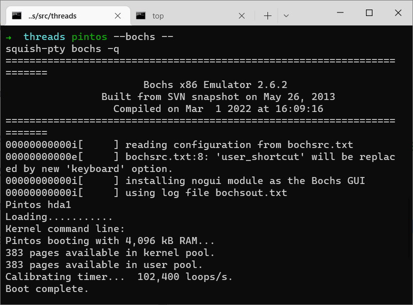
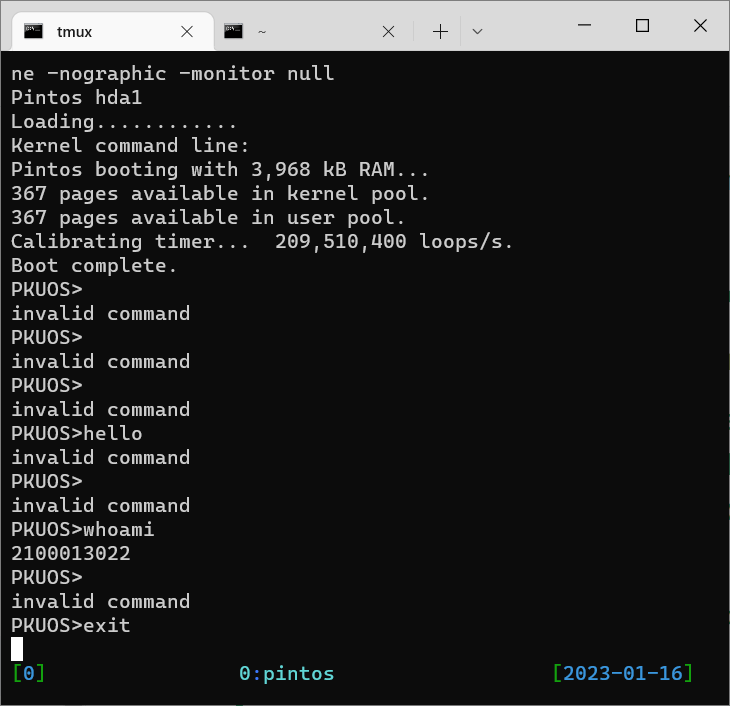

# Project 0: Getting Real

## Preliminaries

>Fill in your name and email address.

永彤 吴 wuyongtong@stu.pku.edu.cn

>If you have any preliminary comments on your submission, notes for the TAs, please give them here.


>Please cite any offline or online sources you consulted while preparing your submission, other than the Pintos documentation, course text, lecture notes, and course staff.

google.com


## Booting Pintos

>A1: Put the screenshot of Pintos running example here.



## Debugging

#### QUESTIONS: BIOS 

>B1: What is the first instruction that gets executed?

​	`[f000:fff0]    0xffff0: ljmp   $0x3630,$0xf000e05b`

The first instruction of BIOS.


>B2: At which physical address is this instruction located?

`0xffff0`.


#### QUESTIONS: BOOTLOADER

>B3: How does the bootloader read disk sectors? In particular, what BIOS interrupt is used?

Use BIOS interrupt 0x13 to tell BIOS read disk sectors into memory.


>B4: How does the bootloader decides whether it successfully finds the Pintos kernel?

Read the partition table on each system hard disk and scan for a partition of type 0x20, which means its a Pintos kernel partition.


>B5: What happens when the bootloader could not find the Pintos kernel?

Output `Not found` on the screen and notify BIOS that the boot process failed by interrupt 0x18.


>B6: At what point and how exactly does the bootloader transfer control to the Pintos kernel?

1. After the loader successfully load the whole kernel into memory.

2. The loader read the start address out of the kernel (it's a ELF format file) and convert it from a 32-bit linear address into a 16:16 segment:offset address for real mode addressing.

   To be specific, the loader get 2 bytes (`0x0058`) at `0x20018` and put them at the label `start` in the kernel, and another `0x2000` is placed at the address `start + 2`, and a `ljmp *start` is executed to jump to the address `0x20058`, which is `start()` in `threads/start.S`.

3. By the way, `loader.asm` is misread by `objdump`, I suppose it's because this little piece of code runs under real mode. 


#### QUESTIONS: KERNEL

>B7: At the entry of pintos_init(), what is the value of expression `init_page_dir[pd_no(ptov(0))]` in hexadecimal format?

0.


>B8: When `palloc_get_page()` is called for the first time,

>> B8.1 what does the call stack look like?
>
>```
>(gdb) bt
>#0  palloc_get_page (flags=(PAL_ASSERT | PAL_ZERO)) at ../../threads/palloc.c:113
>#1  0xc00203aa in paging_init () at ../../threads/init.c:168
>#2  0xc002031b in pintos_init () at ../../threads/init.c:100
>#3  0xc002013d in start () at ../../threads/start.S:180
>```
>
>

>> B8.2 what is the return value in hexadecimal format?
>>
>> `0xc0101000`

>> B8.3 what is the value of expression `init_page_dir[pd_no(ptov(0))]` in hexadecimal format?
>>
>> still 0.


>B9: When palloc_get_page() is called for the third time,

>> B9.1 what does the call stack look like?
>
>```
>(gdb) bt
>#0  palloc_get_page (flags=PAL_ZERO) at ../../threads/palloc.c:113
>#1  0xc0020a81 in thread_create (name=0xc002e895 "idle", priority=0, function=0xc0020eb0 <idle>, aux=0xc000efbc) at ../
>../threads/thread.c:178
>#2  0xc0020976 in thread_start () at ../../threads/thread.c:111
>#3  0xc0020334 in pintos_init () at ../../threads/init.c:119
>#4  0xc002013d in start () at ../../threads/start.S:180
>```
>
>

>> B9.2 what is the return value in hexadecimal format?
>>
>> `0xc0103000`

>> B9.3 what is the value of expression `init_page_dir[pd_no(ptov(0))]` in hexadecimal format?
>>
>> `0x102027`


## Kernel Monitor

>C1: Put the screenshot of your kernel monitor running example here. (It should show how your kernel shell respond to `whoami`, `exit`, and `other input`.)



#####

>C2: Explain how you read and write to the console for the kernel monitor.

Through functions `printf,puts,putchar` to write the console,  and function `input_getc` to read from the console.

To be specific, 

- all the output functions are implemented by `kernel/console.c`. It maintains a lock and is responsible to output data into VGA and the serial.
- the `input_getc` function in `devices/input.c` uses a ring buffer with lock to communicate with `kbd.c` who handles keyboard interrupts.

