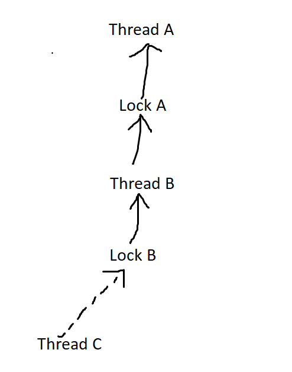

# Project 1: Threads

## Preliminaries

>Fill in your name and email address.

永彤 吴 wuyongtong@stu.pku.edu.cn

>If you have any preliminary comments on your submission, notes for the
>TAs, please give them here.


>Please cite any offline or online sources you consulted while
>preparing your submission, other than the Pintos documentation, course
>text, lecture notes, and course staff.

google.com


## Alarm Clock

#### DATA STRUCTURES

>A1: Copy here the declaration of each new or changed struct or struct member, global or static variable, typedef, or enumeration.  Identify the purpose of each in 25 words or less.

```c
// The list contains all sleeping threads, ordered by wakup_tick,
// shared with timer interrupt handler.
static struct list sleeping;

struct thread {
	// The tick when this thread should wake up
    int64_t wakeup_tick;         	
    
    // Being initialized and down when timer_sleep (), up when timer_interrupt ()
    struct semaphore sleep_sema;  	
    
    // Used by sleeping list
    struct list_elem sleep_elem;	
}
```


#### ALGORITHMS

>A2: Briefly describe what happens in a call to timer_sleep(),
>including the effects of the timer interrupt handler.

1. Calculate wakeup tick, initialize this thread's `sleep_sema` to 0.
2. Insert this thread into the list `sleeping` **(with interrupt disabled)**
3. Call `sema_down(&sleep_sema)` to wait timer interrupt handler to unblock this thread.


Timer Interrupt Handler is responsible to check the `sleeping` list. 
If `wakeup_time <= current_ticks` , it ups the semaphore to allow the thread's executing, until it finds a thread doesn't need to be waked up.


>A3: What steps are taken to minimize the amount of time spent in
>the timer interrupt handler?

Create a **ordered** list for sleeping threads. So we just need to check **one more thread** which is still sleeping.


#### SYNCHRONIZATION

>A4: How are race conditions avoided when multiple threads call
>timer_sleep() simultaneously?

All the data accessed is **per thread data**, except the `sleeping` list, which is protected by disabling interrupt.


>A5: How are race conditions avoided when a timer interrupt occurs
>during a call to timer_sleep()?

1. Use a semaphore to realize `block` and `unblock` behaviors, **rather than use these two function directly.** Initialize the semaphore to `0` **before** the timer interrupt handler can wake it up.
2. **Disable interrupts** when modifying `sleeping` list.

#### RATIONALE

>A6: Why did you choose this design?  In what ways is it superior to
>another design you considered?

1. **Simplicity: ** there is **no** extra dynamic memory allocation, I can implement it in tens of line.
3. **Extendibility: ** a priority queue can be adopted without much code modification, if necessary, to support quick insert.

It seems few alternative feasible design.


## Priority Scheduling

#### DATA STRUCTURES

>B1: Copy here the declaration of each new or changed struct or struct member, global or static variable, typedef, or enumeration.  Identify the purpose of each in 25 words or less.

```C
@@ -251,6 +306,7 @@ struct semaphore_elem
   {
     struct list_elem elem;              /**< List element. */
     struct semaphore semaphore;         /**< This semaphore. */
+    struct thread * thr;                /**< The thread who waits this semaphore */
   };

@@ -22,6 +24,7 @@ struct lock
   {
     struct thread *holder;      /**< Thread holding lock (for debugging). */
     struct semaphore semaphore; /**< Binary semaphore controlling access. */
+    struct list_elem elem;      /**< Used by holder's list `locks_held` */
   };

@@ -87,12 +89,29 @@ struct thread
     enum thread_status status;          /**< Thread state. */
     char name[16];                      /**< Name (for debugging purposes). */
     uint8_t *stack;                     /**< Saved stack pointer. */

     int priority;                       /**< Priority boosted by locks held */
+    int origin_priority;                /**< Original priority. */

+    /** The lock waiting tree */
+    struct list locks_held;             /**< All locks it holds currently */
+    struct lock *waiting_lock;          /**< The lock this thread is waiting (if any) */
```


>B2: Explain the data structure used to track priority donation.
>Use ASCII art to diagram a nested donation.  (Alternately, submit a
>.png file.)

The lock waiting relationship forms a tree, I call it `lock waiting tree`. 

- The father of a thread is the lock it's waiting.
- The father of a lock is  the thread who holds it.



When Thread C is acquiring Lock B, it will disable interrupts and donates its priority to Thread B and Thread A through the tree link. 

#### ALGORITHMS

>B3: How do you ensure that the highest priority thread waiting for
>a lock, semaphore, or condition variable wakes up first?

Because I maintain the priorities at other places, here I just need to pick up the one with highest priority in all waiters.


>B4: Describe the sequence of events when a call to lock_acquire()
>causes a priority donation.  How is nested donation handled?

1. Disable interrupts and boost all the thread in lock waiting tree.
2. Wait the lock's holder to release the lock.
3. Update the structure of lock waiting tree.
4. There is **no** need to update the current thread's priority, because it's one of the waiters with highest priorities. So there is no need for the other waiters to donate their priorities.
5. Enable interrupts.


>B5: Describe the sequence of events when lock_release() is called
>on a lock that a higher-priority thread is waiting for.

The thread which releases the lock:

1. This thread will disable the interrupts and do the following atomatically.
2. Update the structure of lock waiting tree.
3. **Release the lock and up the semaphore.**
4. Update it's priority from the rest of locks it's still holding.
5. Enable interrupts.

The thread which acquires the lock: when the holder finish step (3), it wakes up from steps (2) and continues to execute the following. *(the steps is exactly the same, as B4)*

1. Disable interrupts and boost all the thread in lock waiting tree.
2. **Wait the lock's holder to release the lock.**
3. Update the structure of lock waiting tree.
4. There is no need to update the current thread's priority, because it's one of the waiters with highest priorities. So there is no need for the other waiters to donate their priorities.
5. Enable interrupts.


#### SYNCHRONIZATION

>B6: Describe a potential race in thread_set_priority() and explain
>how your implementation avoids it.  Can you use a lock to avoid
>this race?

It needs to write the priority and update the thread it has donated. The priority data **is shared with timer interrupt handler** (which will use it to determine the thread with the highest priority to wake up). **So we can't use a lock to avoid the race, disabling interrupts is a must.**


#### RATIONALE

>B7: Why did you choose this design?  In what ways is it superior to
>another design you considered?


**Simplicity: ** there is **no** extra dynamic memory allocation. Compared to other designs, **it's quite straightforward**. It doesn't require a lot of synchronization tricks, either. This is important to be free of bugs.

**Low overhead: ** this mechanism only updates threads' priority when necessary, and especially it doesn't add extra work to timer interrupt handler. 

**Dead lock detection: ** this mechanism can detect deadlock when going through the tree link.

**Correctness:** the correctness can be simply analyzed out, and the behavior of this design is reasonable for priority scheduling. But many designs I have tried have obvious flaws. In some cases which isn't covered by test, they may fail.


## Advanced Scheduler

#### DATA STRUCTURES

>C1: Copy here the declaration of each new or changed struct or struct member, global or static variable, typedef, or enumeration.  Identify the purpose of each in 25 words or less.

```C
@@ -106,6 +125,7 @@ struct thread
// To measure the whole system's ready thread count during a time window.
+extern fixedpoint load_avg;

@@ -87,12 +89,29 @@ struct thread
    // To measure a thread's recently used CPU time.
+    fixedpoint recent_cpu;

	// To measure a thread's tolerance. Lower nice bring more CPU time
+    int nice;									

// The fixed point type
typedef int32_t fixedpoint;
```


#### ALGORITHMS

>C2: How is the way you divided the cost of scheduling between code
>inside and outside interrupt context likely to affect performance?

If the handler takes too long, it will occupy most of a tick and leave little for the workload. So the effective CPU time is less, which affects the performance. What's more, it will affect our estimation of the tasks' running situation, even changes our scheduling decision.


#### RATIONALE

>C3: Briefly critique your design, pointing out advantages and
>disadvantages in your design choices.  If you were to have extra
>time to work on this part of the project, how might you choose to
>refine or improve your design?

I just use one queue, and calculate almost everything I need in the timer interrupt handler.

Advantages: 

- simple, easy to write and debug

Disadvantages:

- slow, need to go through the whole queue to find the highest priority thread.

How to improve:

- use bitmap, and set up real multilevel feedback queues, to lower scheduling overhead.


>C4: The assignment explains arithmetic for fixed-point math in
>detail, but it leaves it open to you to implement it.  Why did you
>decide to implement it the way you did?  If you created an
>abstraction layer for fixed-point math, that is, an abstract data
>type and/or a set of functions or macros to manipulate fixed-point
>numbers, why did you do so?  If not, why not?

I decide to implement it 

- in a new independent module `lib/fixedpoint.c` and `lib/fixedpoint.h`. It's universal to both kernel and user program.
- using`typedef int32_t fixedpoint` to remind the programmer (i.e. me).
- **in a set of macros**. Because the overhead of function call is considerable, and it'll affect the handler's performance obviously.

